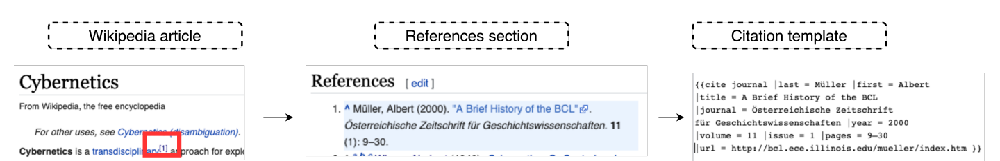
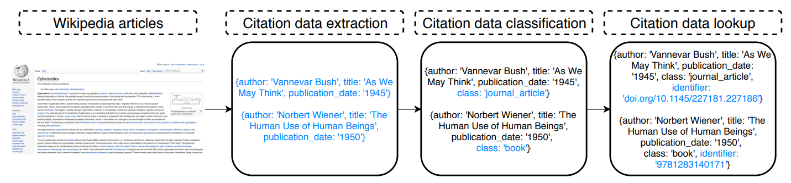
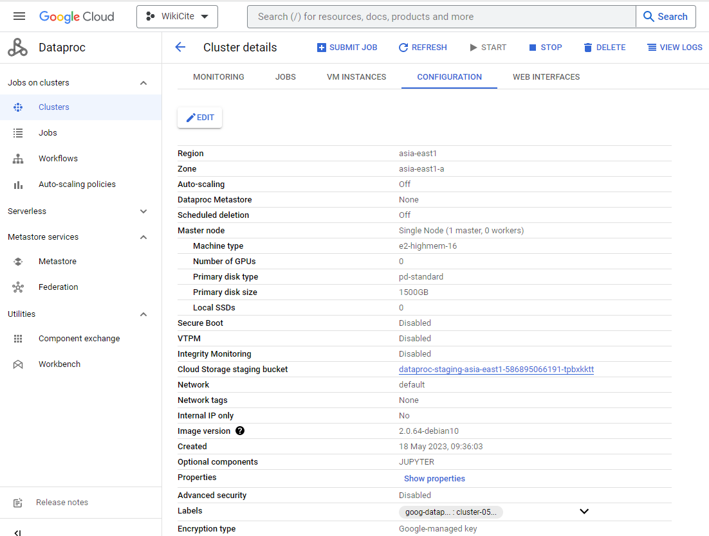
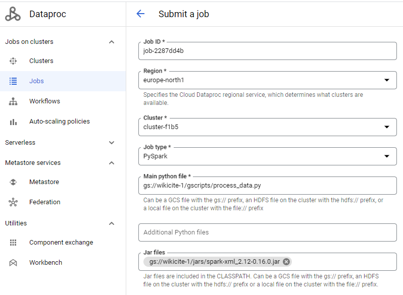

# Extraction and classification of references from Wikipedia articles.

This is the refactored and generalized code for Wikipedia citation extraction originally developed by Harshdeep et al. 
(https://github.com/Harshdeep1996/cite-classifications-wiki). 

Given a Wikipedia dump, the code retrieves citations and harmonizes citation templates (structure citations 
using the same schema).  



After extraction, citations are classified as 'journal', 'book', 'news', or 'other'. Furthermore, part of the citations 
which are likely to refer to books or journals (i.e., defined using corresponding Wikipedia templates) are augmented 
with identifiers located via Google Books and Crossref APIs.  



Folder "scripts" contains scripts that run on Python 3 in the environment with up-to-date dependencies 
(see requirements.txt for relevant module versions). 
 - process_data.py combines all data processing functions related to citation extraction and dataset preparation
 - train_citation_classifier.py deals with labelled dataset preparation and classifier training, as described in 
   (https://arxiv.org/abs/2007.07022).*
 - predict_citations.py allows users to classify extracted citations to chosen categories (book, journal, or web).* 
   
  <small>
   * These scripts are retained for compatibility with the earlier version of the software. 
   We advocate the use of a simple deterministic classifier that labels citations as 'book', 'journal', 'news', or 'other', 
   as explained further in this document.  
   </small>
   
Scripts can be executed locally or in a cloud-based environment (tested on a GCloud dataproc cluster).

## Configuration

- Set PROJECT_HOME to point to your home location, e.g., GCloud bucket `gs://wikicite-1/`. 
- Set INPUT_DIR to the relative path to the directory containing Wikipedia dumps for parsing, e.g., `data/dumps`.
- Set OUTPUT_DIR to the output folder, e.g., `data/`. 

We use constant `ext` to indicate which language we are working with, it is added as prefix to output file names. 

## Output  
Several sub-directories are used for intermediate result output: 

  1. citations - contains extracted citations with identifiers ['id', 'title', 'revision.text' -> 'content', 
     'revision.id' -> 'r_id', 'revision.parentid' -> r_parentid, 'citations', 'sections', 'type_of_citation'] 
  2. separated - contains citations with generic template features, i.e., 
        ['Degree', 'City', 'SeriesNumber', 'AccessDate, 'Chapter', 'PublisherName', 'Format', 'Title',
            'URL', 'Series', 'Authors', 'ID_list', 'Encyclopedia', 'Periodical', 'PublicationPlace', 'Date', 
            'Edition', 'Pages', 'Chron', 'Issue', 'Volume', 'TitleType']

  Optional steps 3-6 can be used to extract context in which the citations were used in the Wikipedia article:

  3. content - contains extracted citations [id, 'title' -> 'page_title', 'revision.text' -> 'content']
  4. base - contains citations with context features ['id', 'page_title', 'citations_features'].  
  5. features - complete dataset: merges generic template features with context features, fields ['total_words', 'neighboring_words', 'neigboring_tags'] 
     added to the dataframe at step 3. 
  6. features_ids - filtered dataset with non-empty identifiers (non-empty 'ID_list')

  Optional steps 7-8 can be used to prepare labelled dataset for the neural network classifier described in the paper    

  7. book_journal  - part of the dataset with ids that we recognise as books or journals.
  8. news          - citations referring to news media.   
  9. news/features - if needed, the citation dataset, before or after classification and lookup, can be merged with auxiliary 
     (context) features. 
     
## Running data processing script on GCloud
  The script can be executed on PySpark as described by S. Harshdeep in the original project wiki.
  Here we provide instructions for configuring a Google Cloud Dataproc cluster for dataset processing.

  1. Create a project following generic instructions as in https://developers.google.com/workspace/guides/create-project. 
  2. Create a storage bucket https://cloud.google.com/storage/docs/creating-buckets.
  3. Create a data folder and download a chosen dump with Wikipedia articles https://dumps.wikimedia.org/wikidatawiki/. 
     Currently, only English-based citation templates are supported. Support for templates in other languages is work in progress.
  4. Create a single node dataproc cluster with enabled JupyterLab component. Configure node to have sufficient memory 
     to process the chosen dump, e.g., we recommend E2-highmem-32 node providing 16CPU/128GB for full English dump.
    
     
<small>
    Resource availability depends on chosen region, hence you may need to explore several regions to find out which one supports 
     the required configuration. We did not find instructions on how to install custom libraries on workers in 
     1-master + N-workers configurations as the virtual environment configuration examples show only cases with pip and conda libraries 
     which are downloaded from public repositories during cluster creation.    
</small>
     
  5. Open the configuration of the created cluster on the dashboard and access its JupyterLab via the tab "Web Interfaces".
     Upload requirements.txt and zipped libraries wikiciteparser and mwparserfromhell 
     to the folder `home/[user_name]`. Install required dependencies, unzip and install the libraries:
```
     pip install -r requirements.txt
     cd wikiciteparser
     python setup.py install
     cd ../mwparserfromhell
     python setup.py install
```
  6. Download nltk resources where it can be seen by the running pipeline, i.e.,
    
```
    import nltk
    nltk.download('popular',  download_dir='home/')
```
     
  7. Configure a PySpark job to run the process_data.py script on the chosen cluster providing a path to it in the field 
     "Main python file", e.g., `gs://wikicite-1/gscripts/process_data.py`. 
     Upload a spark-xml module to your bucket and provide path to it in jar-files, e.g., 
     `gs://wikicite-1/jars/spark-xml_2.12-0.16.0.jar`  
    
     
  Execute the job (may take up to several days for large files).
    
## Classification    
  ### Deterministic classifier
  The preparation of the training dataset for the NN classifier appears to be compromised by selection bias: 
  the method selects citations with DOI, PMID, PMC, and ISBN identifiers and labels them as 'book' or 'journal'; 
  it also selects citations with certain top domains in URL that refer to news portals and labels them as 'web'. 
  Then the classifier is trained and applied to label the whole dataset. However, it is clear that the training dataset 
  does not represent a randomized sampling from the whole dataset, many variants of citations are not represented, 
  and hence, the high performance observed on the part of the labelled dataset used for testing does not prove that the 
  classifier works well for labelling Wikipedia citations in general.          
 
  Therefore, we release for public use only a conservatively labelled dataset with citations classified to 
  'book', 'journal', 'news', and 'other' categories using a deterministic classifier 
   (same as for selecting training set for the NN classifier in the original approach but with a much larger set of 
   media news top domains).

  ### NN classifier   
  The classifier is described in (https://arxiv.org/abs/2007.07022).
  Our (preliminary) feature importance analysis indicates that the trained classifier mainly relies on citation text.
  Classification accuracy on a dataset without context features ('total_words', 'neighboring_words', 'neigboring_tags') 
  is almost the same as on the joint dataset. Considering that the process of extracting the context features is time-consuming,
  we recommend skipping it even if one chooses to use the NN classifier. 

  ### News top domains
  To select citations that refer to news, we collected news media links from 4 sources and extracted 22646 
  unique top domains (website top domains + social media page subdomains):
  1. [mediabiasfactcheck.com](http://www.mediabiasfactcheck.com)
      The resource provides 9 categories of media sources, 5 of which are news portals with or without political bias 
      (least, left, right, left center and right center bias), and 4 categories with other sources (conspiracy-presudo,
      questionable, satire, and science). We omit 4 latter categories as they are not suitable for 
      classifying wikipedia citations as 'news' (while 'science' domains are trustworthy, they list many journal web cites - 
      ideally, we would like to label wikipedia citations with such urls as 'journals'.
   2. [newspaperindex.com](http://www.newspaperindex.com)
      A list of the most important online newspapers and other news sources in all countries in the world. 
      All the newspapers focus on general news, politics, debate and economy, and they are free to access online.
   3. [newsmedialists.com](http://.www.newsmedialists.com)  
      The resource lists links to newspapers, magazines, tv and radio channels per country, as well as to their social network
      pages (Facebook, Instagram, Twitter, Pinterest, and Youtube).
   4. Github projects [news_domain_labeled](https://github.com/vegetable68/news_domain_labeled) and  
      [us-news-domains](https://github.com/ercexpo/us-news-domains) assembled list of 3976 and 5000 news domains, respectively.
   
We join top domains from the above resources into a set and classify a citation with given URL as news if it's top domain 
is in this set (containing 22646 entries in total).
      
## Lookup
   Citations that were categorized as 'other' due to the absence of identifiers may still be valid references to books 
   or journals. One way to establish this is to lookup for reference sources in citation databases such as 
   Crossref or Google Books.`Lookup.py` is a script that searches for source titles in Wikipedia citations with templates 
   'cite book', 'cite journal', 'cite encyclopedia', and 'cite proceedings', and augments the extracted  dataset with retrieved identifiers if a match is found.
   The aforementioned citation databases return the best matches that may or may not coincide with the requested titles.
   Hence, we only consider the search successful if the returned title has small editing distance from the requested title.
   The similarity threshold is set to 75%, see [report](https://arxiv.org/abs/2204.10766) from a related project for 
   an explanation on the choice of this threshold. 

   The lookup with follow-up validation based on editing distance is a relatively slow process. To mitigate this step 
   from potential failing (due to network issues, denial of service, wrong return format etc.) on millions of requests,
   we process each parquet file separately and provide an option to save results in batches of a chosen size. For that 
   reason we run the lookup.py script not as Spark job. To reproduce our results on GCloud, copy the dataset to the local 
   disk, e.g., 

    gsutil -m cp -r "gs://wikicite-1/data/full/book_journal" 
  
The script will copy the data to the folder book_journal_ext, which can be copied back to the bucket storage as follows:
    
    gsutil cp -r book_journal_ext  gs://wikicite-1/data/full
 
